## this is the dockerfile for every container except datebase
- 
## Part 1
## and this is init.sql file we need it to initiate the datebase 
- 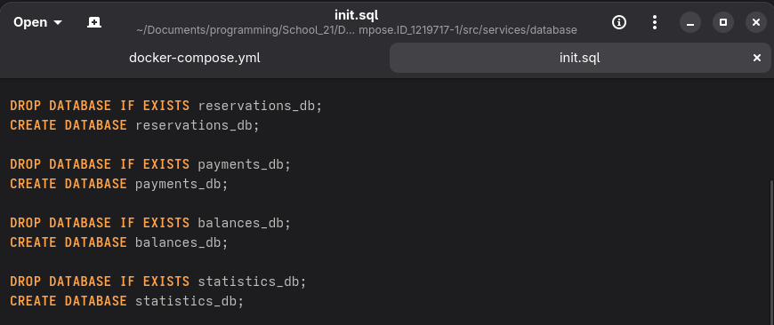
## and this is the Docker Compose file:
- 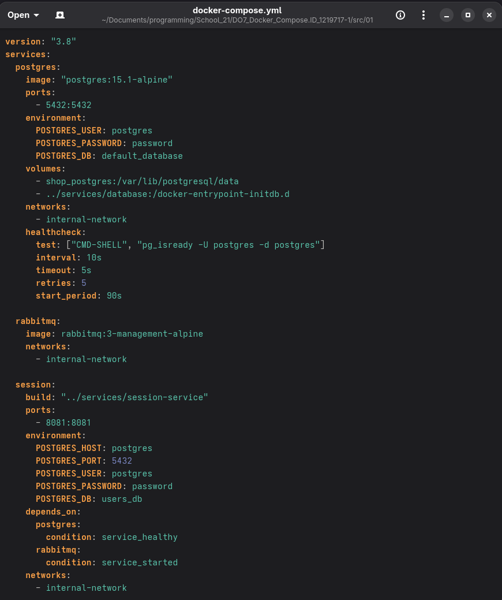
- 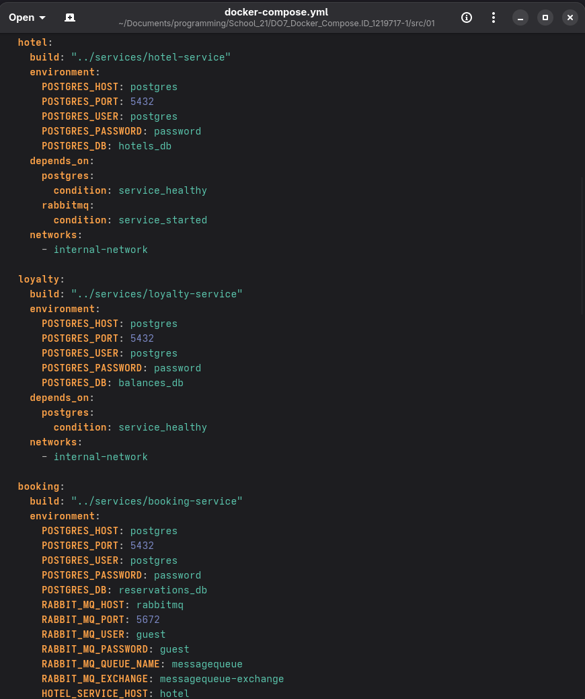
- 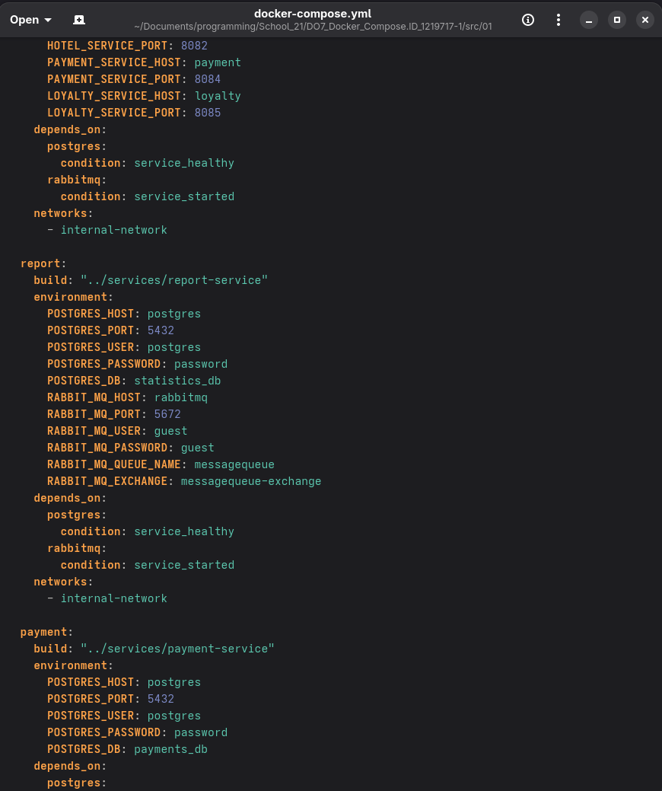
- 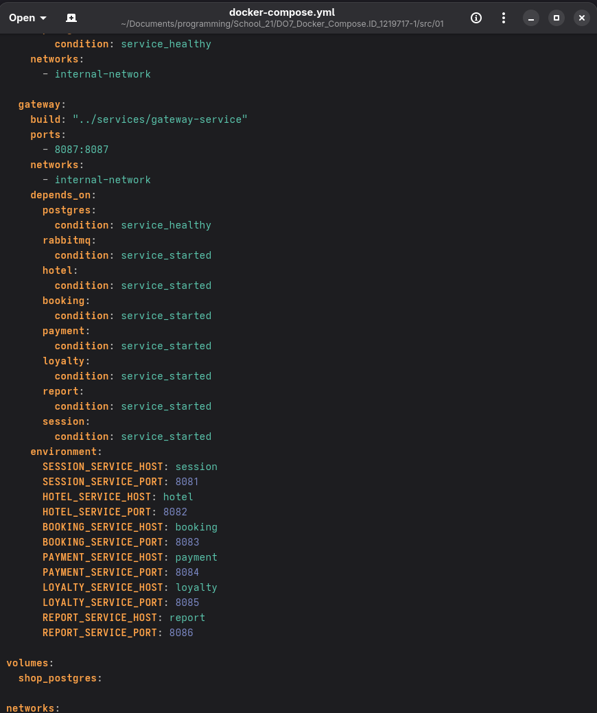
- 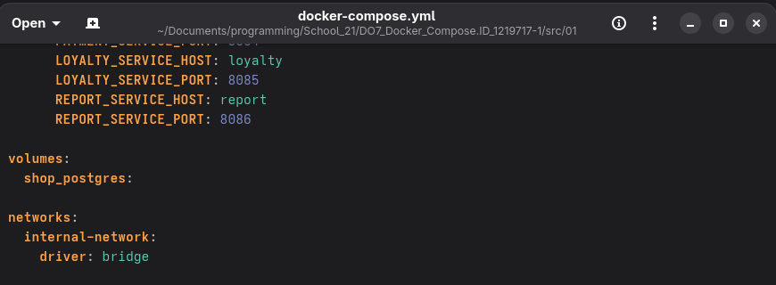
## and after do the the next two command `DOCKER_BUILDKIT=0 docker compose build` then `docker compose up -d` everything works well.
- 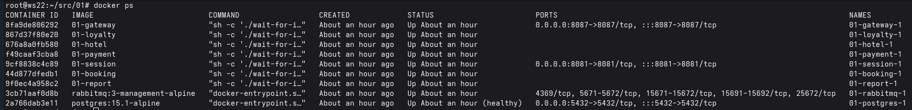
- 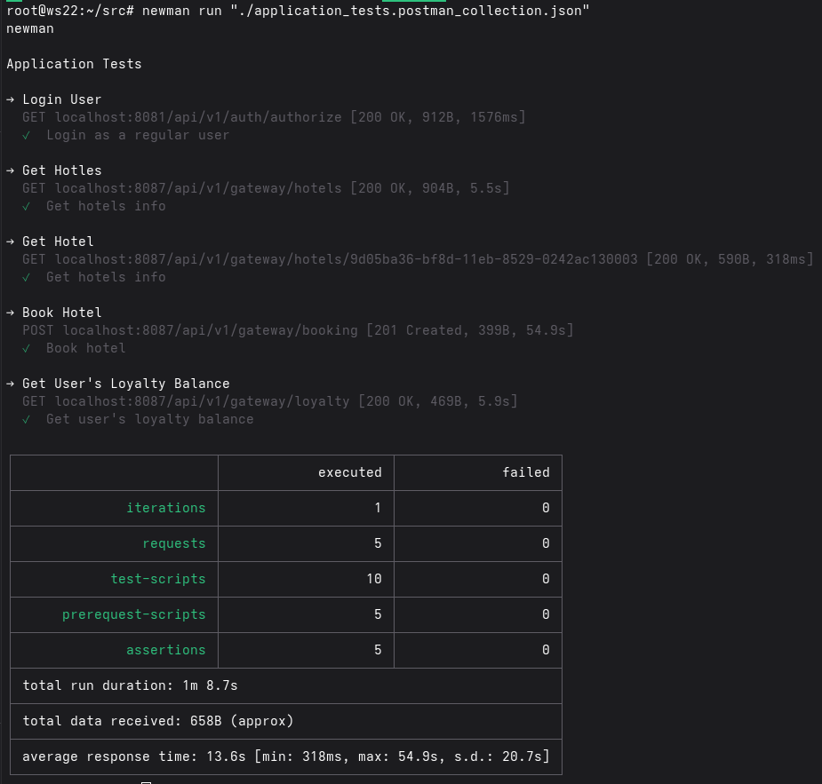

## Part 2
- I setup a machine using vagrant file 
- 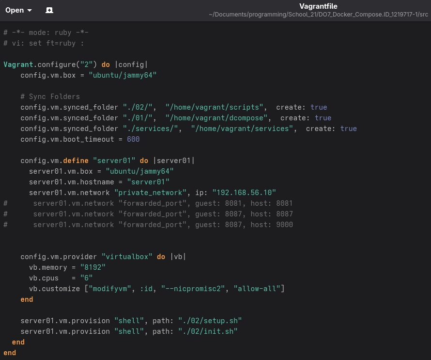

- beside that I create some script files and they will run while creating the vm machine, first one is to install docker
- 

- and the second one is to run docker composer
- 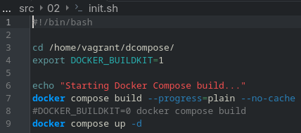

- and now to run this project we need to use these two command first one `vagrant up` and then `vagrant provision`

-  after everything build we can ssh to the machine `vagrant ssh` and then do a test to check if everything is up and running
- 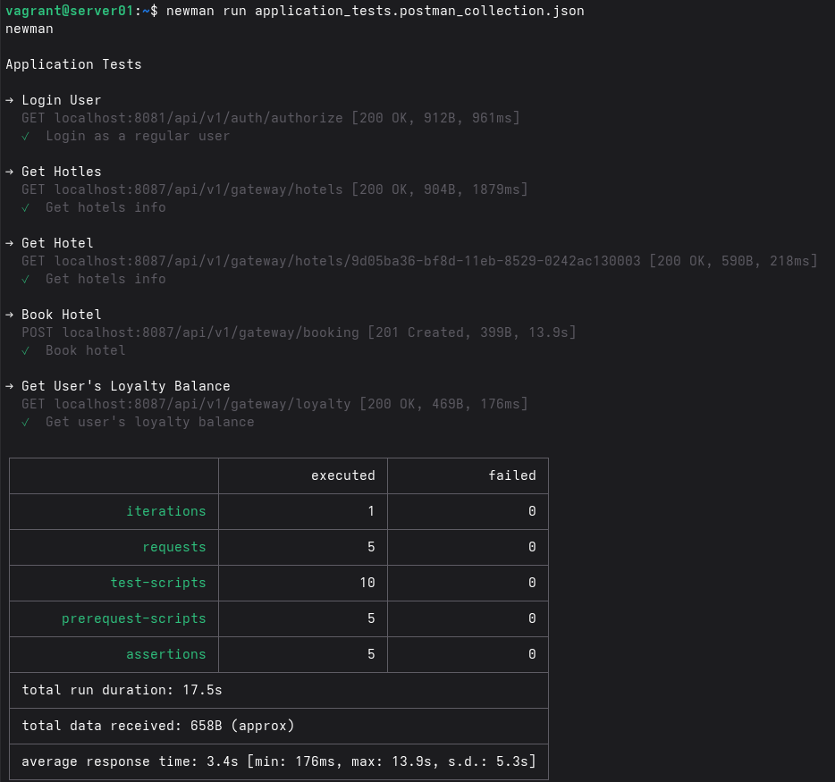

## Part 3
- I register and login to docker website 
- 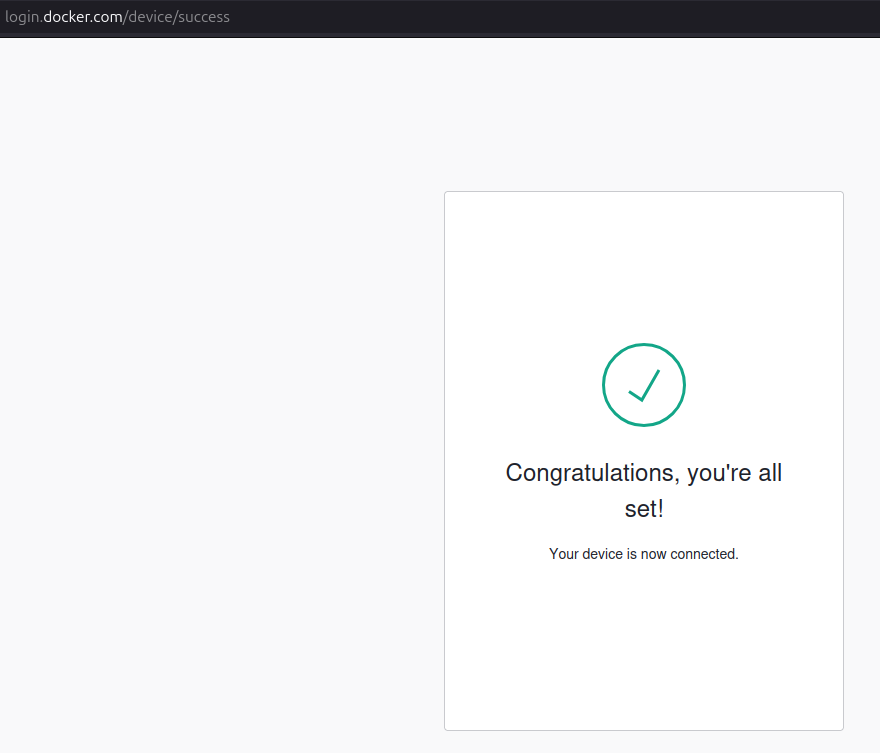
- and I upload the images
- 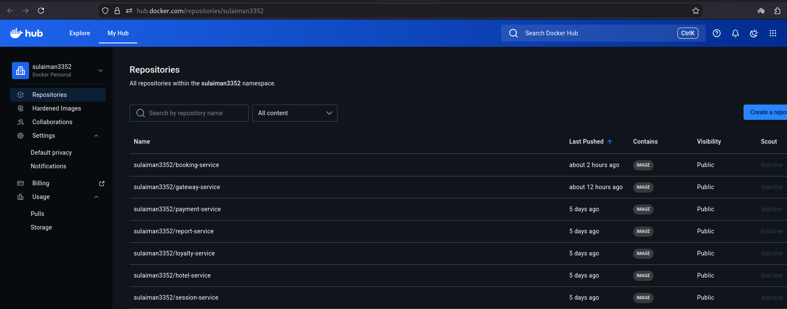

- to build the containers, change the directory to dcompose and run 'docker stack deploy -c docker-compose.yml myapp'
- and then to list we can do 'docker stack ps myapp'
- to run the Postman test we will use the command line version of it and called newman, first we need to install it via npm package manager.
- then run 'newman run application_tests_updated.json'
- 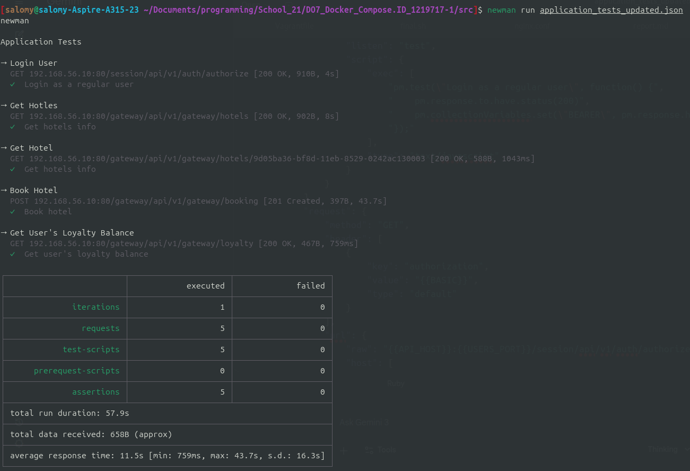
- 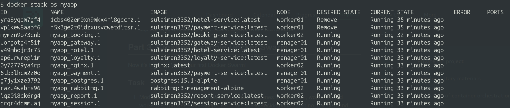
- To use portainer I needed to create file in '/etc/docker/daemon.json' with contant 
'{
  "min-api-version": "1.24"
}' in each machine, then 'sudo systemctl restart docker' finally run 'docker stack deploy -c portainer-stack.yml portainer'
- 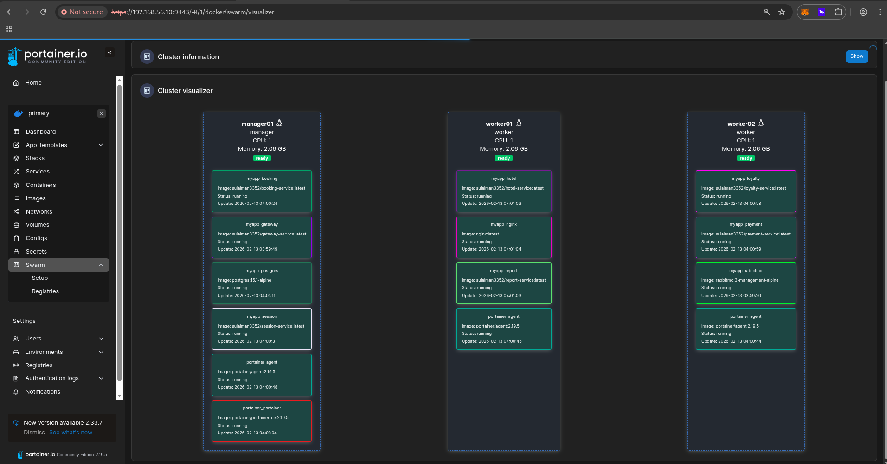
